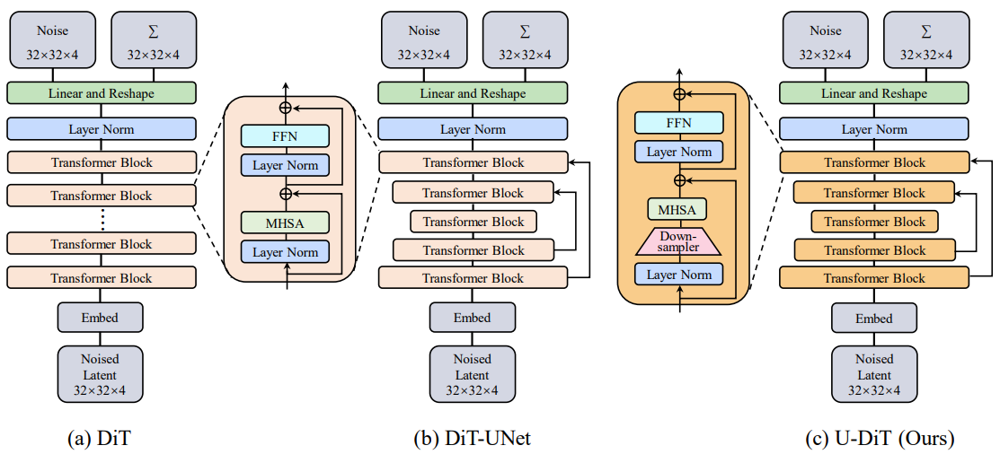

# U-DiTs: Downsample Tokens in U-Shaped Diffusion Transformers

<p align="left">
<a href="https://arxiv.org/abs/2405.02730" alt="arXiv">
    </a>
<a href="https://huggingface.co/yuchuantian/U-DiT/tree/main" alt="Hugging Face Models">
    </a>
<a href="https://www.modelscope.cn/models/YuchuanTian/U-DiT/files" alt="ModelScope Models">
    </a>
<a href="https://colab.research.google.com/drive/17ZimD7GdK2ZZHRg52_I9PNxDTs0LKd20?usp=sharing" alt="ModelScope Models">
    </a>
</p>


This is the official implementation of ["U-DiTs: Downsample Tokens in U-Shaped Diffusion Transformers"](https://arxiv.org/abs/2405.02730).



**Outline**

🤔 In this work, we rethink "Could U-Net arch boost DiTs?"

😮 Self-attention with downsampling reduces cost by ~**3/4**, but improves U-Net performance.

🥳 We develop a series of powerful **U-DiT**s. 

🚀 U-DiT-B could outcompete DiT-XL/2 with only **1/6** of its FLOPs.


## Preparation

Please run command ```pip install -r requirements.txt``` to install the supporting packages.

(Optional) Please download the VAE from this [link](https://huggingface.co/stabilityai/sd-vae-ft-ema). The VAE could be automatically downloaded as well.

## Training

Here we provide two ways to train a U-DiT model: 1. train on the original ImageNet dataset; 2. train on preprocessed VAE features (Recommended).

**Training Data Preparation**
Use the original ImageNet dataset + VAE encoder. Firstly, download ImageNet as follows:


```
imagenet/
├──train/
│  ├── n01440764
│  │   ├── n01440764_10026.JPEG
│  │   ├── n01440764_10027.JPEG
│  │   ├── ......
│  ├── ......
├──val/
│  ├── n01440764
│  │   ├── ILSVRC2012_val_00000293.JPEG
│  │   ├── ILSVRC2012_val_00002138.JPEG
│  │   ├── ......
│  ├── ......
```

Then run the following command:

```bash
torchrun --nnodes=1 --nproc_per_node=8 train.py --data-path={path to imagenet/train} --image-size=256 --model={model name} --epochs={iteration//5000} # fp32 Training

accelerate launch --mixed_precision fp16 train_accelerate.py --data-path {path to imagenet/train} --image-size=256 --model={model name} --epochs={iteration//5000} # fp16 Training
```

**Training Feature Preparation (RECOMMENDED)**

Following Fast-DiT, it is recommended to load VAE features directly for faster training. You don't need to download the enormous ImageNet dataset (> 100G); instead, a much smaller "VAE feature" dataset (~21G for ImageNet 256x256) is available here on [HuggingFace](https://huggingface.co/datasets/yuchuantian/imagenet_vae_256) and [MindScope](https://www.modelscope.cn/models/YuchuanTian/imagenet_vae_256/). Please do the following steps:

1. Download [imagenet_feature.tar](https://huggingface.co/datasets/yuchuantian/imagenet_vae_256/blob/main/imagenet_feature.tar)

2. Unzip the tar ball by running ```tar -xf imagenet_feature.tar```

```
imagenet_feature/
├── imagenet256_features/ # VAE features
└── imagenet256_labels/ # labels
```

3. Append parser ```--feature-path={path to imagenet_feature}``` to the training command.

## Inference

#### Weights Available

🔥 We released our models via [**HuggingFace**](https://huggingface.co/yuchuantian/U-DiT/tree/main) and [**ModelScope**](https://www.modelscope.cn/models/YuchuanTian/U-DiT/files). Please feel free to download them!

#### Sampling

Run the following command for parallel sampling:

```bash
torch --nnodes=1 --nproc_per_node=8 sample_ddp.py --ckpt={path to checkpoint} --image-size=256 --model={model name} --cfg-scale={cfg scale}
```

After sampling, an .npz file that contains 50000 images is automatically generated.

#### Metric Evaluation

We borrow the FID evaluation codes from [here](). Metrics including FIDs are calculated based on the .npz file. Before evaluation, make sure to download the [reference batch](https://openaipublic.blob.core.windows.net/diffusion/jul-2021/ref_batches/imagenet/256/VIRTUAL_imagenet256_labeled.npz) for ImageNet 256x256. Then run the following command for metric evaluation:

```bash
python evaluator.py {path to reference batch} {path to generated .npz}
```

## Future work (Stay Tuned!)

- [x] Training code for U-DiTs
- [x] Model weights
- [x] ImageNet features from VAE for faster training
- [x] [Colab demos](https://colab.research.google.com/drive/17ZimD7GdK2ZZHRg52_I9PNxDTs0LKd20?usp=sharing)
- [ ] Outcomes from longer training

## BibTex Formatted Citation

If you find this repo useful, please cite:
```
@misc{tian2024udits,
      title={U-DiTs: Downsample Tokens in U-Shaped Diffusion Transformers}, 
      author={Yuchuan Tian and Zhijun Tu and Hanting Chen and Jie Hu and Chao Xu and Yunhe Wang},
      year={2024},
      eprint={2405.02730},
      archivePrefix={arXiv},
      primaryClass={cs.CV}
}
```

## Acknowledgement

We acknowledge the authors of the following repos:

https://github.com/facebookresearch/DiT (Codebase)

https://github.com/chuanyangjin/fast-DiT (FP16 training; Training on features)

https://github.com/openai/guided-diffusion (Metric evalutation)

https://huggingface.co/stabilityai/sd-vae-ft-ema (VAE)